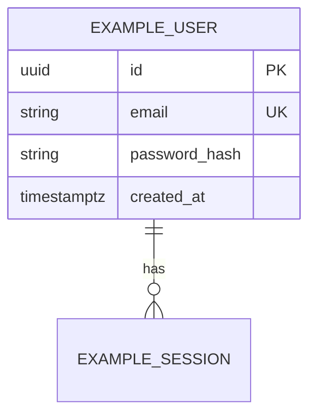
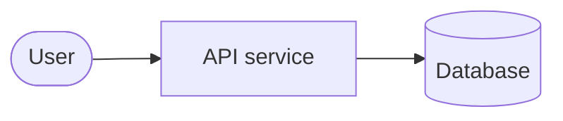
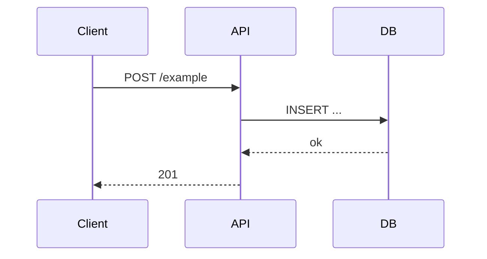

# Architecture diagrams (review-friendly)

**Owner:** Architect · **Formats:** [Mermaid](https://mermaid.js.org/) (primary) — renders on GitHub and in many editors; agents can diff and reason over the source.

Update this file whenever the **data model**, **service boundaries**, or **critical flows** change. Keep diagrams **small**; split into additional sections or linked files if one diagram exceeds ~40 lines.

---

## How to review

| Diagram | What to check |
|---------|----------------|
| **ERD** | Tables, PK/FK, cardinality vs migrations and ORM models |
| **Context / containers** | Matches repo layout and deploy units (`docker-compose`, CI) |
| **Sequence** | Matches implemented API calls and error paths |

Optional: duplicate the schema in **`schema.dbml`** (same folder) for [dbdiagram.io](https://dbdiagram.io) import during human reviews — not required for agents if the Mermaid ERD is complete.

---

## 1. Entity relationship (database)

Replace the example below with the real model for the **current** iteration scope.

---

## 2. System context (optional)

High-level actors and the system boundary.

---

## 3. Key sequence flows (optional)

One diagram per critical path (e.g. registration, auth).

---

## Change log

| Date | Iteration | Change |
|------|-----------|--------|
| — | — | Initial template |
